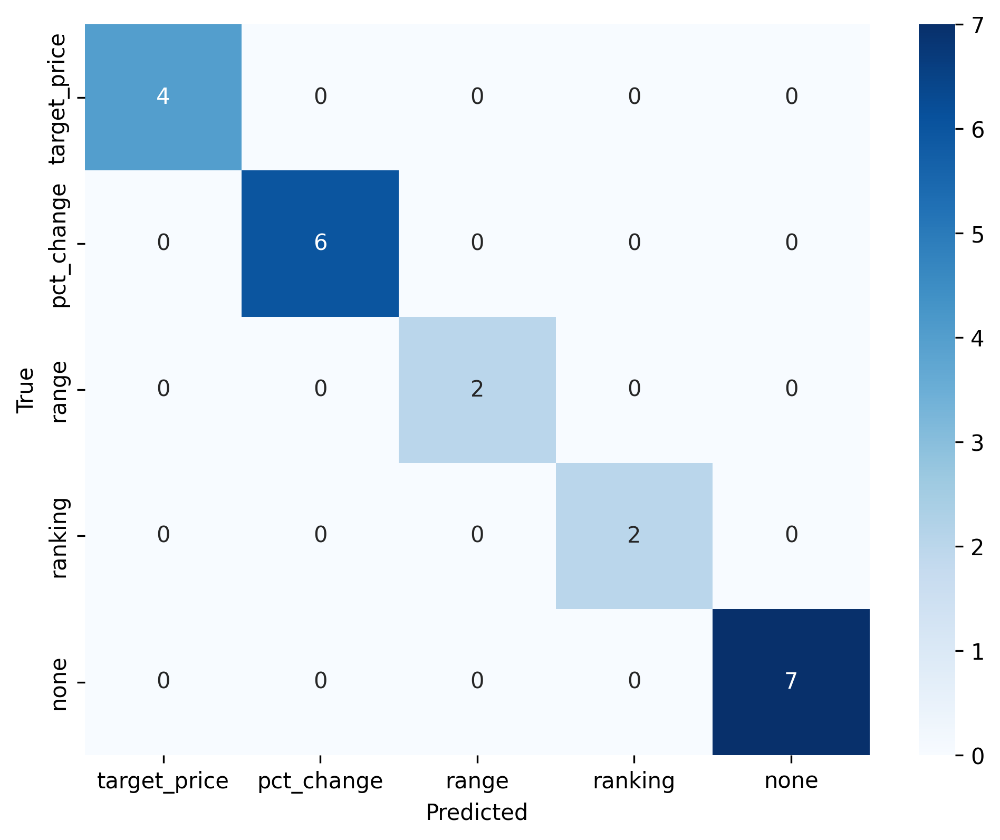

# cripto_inference
Esse projeto tem como objetivo receber um conjunto de tweets via API e extrair informações relevantes ao mercado de cripto. 


# Documentação do projeto

Ao rodar o projeto sera gerado um arquivo com todos os resultado que deram certo (./data/result_correto) e caso algum processo tenha dado errado ele é enviado para (./data/result_errado).


## Como rodar o código:

 - Para rodar o projeto
```bash
    # Instala as dependenciass
    pip install -r requirements.txt

    # Treina o modelo e seleciona a melhor versão dele.
    python src/custom_models.py

    # Dentro do diretório app, execute o comando abaixo para subir a API
    uvicorn main:app --reload

    # Executa as base de teste de entrada na API e gera os arquivos com as saida e os dados que deram erro.
    python main_text.py
```


  ## Features
 - Identificação de qual Cripto é mencionada.
 - API para receber um tweet com data de publicação.
 - Identificar o tipo de alegação que está sendo referida
 - Gerar algumas anotações sobre o dialogo. (Requer o GROQ)
 - Função "generate_labels()" Utiliza do GROQ para gerar um conjunto de labels para ter dados de treino pré-anotados para tentar usar um modelo mais leve depois.
 
 ## Modelo:

Como pode ser observado na matrix de confusão após o treino, o resultado supostamente deu corretamente, mas a amostra de dados é muito pequena para generalizar e os labels foram gerados através de uma LLM devido a tempo.

Para o script de treino foram utilizados as seguintes configurações de teste:

```python
"learning_rate" : [2e-5, 3e-5, 5e-5],
"per_device_train_batch_size" : [2, 4, 8]
"num_train_epochs" : [3, 4, 5],
```

 


 ## Structure
 - `app`: Diretório onde se encontram todas os principais scripts do projeto
 - `app/src/`: Contem os arquivos as funções internas e os schemas criados para manipular os dados.
 - `app/src/finetuned_models`: Diretório gerado ao treinar o modelo, o modelo treinado é usado para classificar o target_type
 - `app/data/`: Includes unit and integration tests.

 ## Dependencies
 - Groq - [Opcional]
 - FastAPI
 - pandas
 - transformers

## Observações:

- Algumas partes eu fiz usando o modelo do GROQ como por exemplo a parte das anotações e acabou que ficou exclusivamente dependente disso para sair o resultados das notas.

- A parte de calculo de datas a range de datas eu não cheguei a conseguir fazer.

- Fiz uma scrapping para obter as 100 principais criptos disponibilizadas pelo site [coinmarketcap](https://coinmarketcap.com/pt-br).


 ## Author
 - Diego Perez
